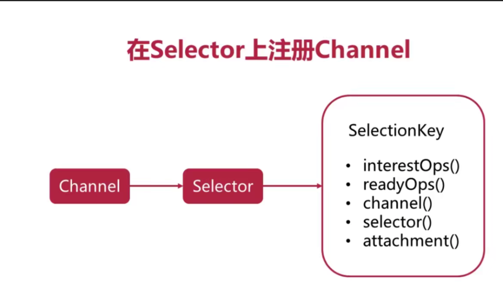
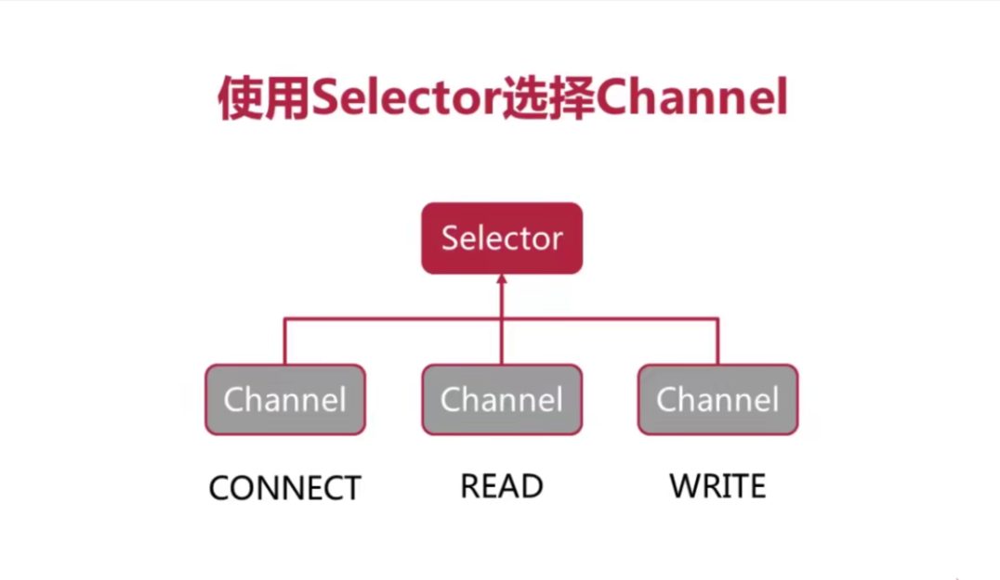

# 在Selector上面注册 Channel

`SelectionKey` : channel在Selector注册的id

`interestOps()`: Selector 监听的状态

`readyOps()` : channel 正在处于哪些可以执行的状态

`channel()`：返回SelectionKey注册的channel对象

`selector()`: 在哪个Selector对象注册

`attachment()`: 对于每一个channel对象可以添加任何你自己认为有意义的对象

# 使用Selector选择Channel

